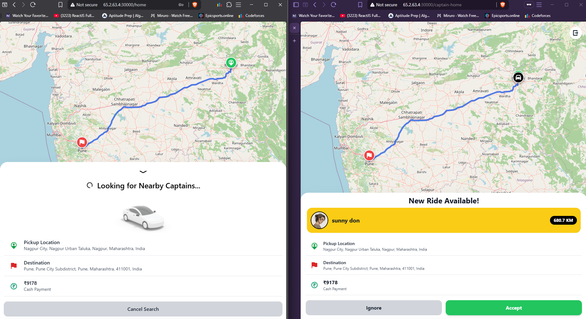
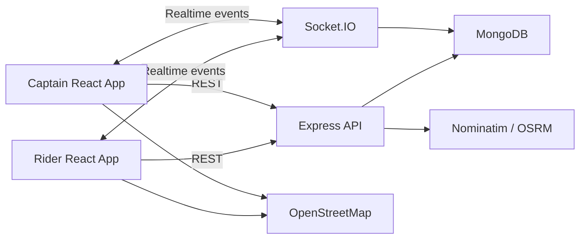

# Rydex

Rydex is a full-stack ride-booking application with separate rider and captain experiences, real-time ride updates, live location tracking, route visualization, and server-side ride state management.

The application models the complete ride lifecycle:

```text
Request → Pending → Accepted → OTP Validation → Ongoing → Completed
                                      └────────────────→ Cancelled
```

It is designed as a learning and demonstration project rather than a production dispatch or payments platform.

## Overview

Rydex provides two role-specific interfaces:

**Rider**
- Search and select pickup and destination locations
- View driving routes and fare estimates
- Choose between car, motorcycle, and auto
- Request and cancel rides
- Receive captain assignment and ride OTP
- Track the captain during an active trip

**Captain**
- Register a vehicle and manage availability
- Share live location through browser geolocation
- Receive compatible ride requests in real time
- Accept rides
- Validate the rider's OTP before starting
- Complete or cancel an active trip

The rider and captain applications communicate with the backend through REST APIs for durable operations and Socket.IO for real-time events.

## Screenshots



## Key Features

- Separate rider and captain authentication flows
- JWT authentication with bcrypt password hashing
- Token blacklist for logout and session invalidation
- Address autocomplete and reverse geocoding
- Driving route calculation with distance and duration
- Fare estimates for car, motorcycle, and auto
- Complete ride state management
- Four-digit OTP validation before ride start
- Real-time ride request and status notifications
- Real-time captain location updates
- Interactive Leaflet map with OpenStreetMap tiles
- Browser geolocation for pickup and captain tracking
- Dockerized production deployment
- Single-origin production setup for frontend, REST API, and Socket.IO

## Architecture



### Request path

```text
React client
    |
    +---- REST --------------------> Express
    |                                  |
    |                                  +----> Validation
    |                                  +----> Controllers
    |                                  +----> Services
    |                                  +----> MongoDB
    |
    +---- Socket.IO ---------------> Socket handlers
                                       |
                                       +----> Ride events
                                       +----> Location events
```

REST is used for operations that must be persisted, such as creating a ride, accepting a ride, starting a ride, and completing a ride.

Socket.IO is used for time-sensitive updates such as new ride requests, ride acceptance, ride status changes, and captain location updates.

## Ride Flow

A typical booking follows this sequence:

```text
Rider
  |
  | Search pickup / destination
  v
Nominatim
  |
  | Address / coordinates
  v
OSRM
  |
  | Distance / duration / route geometry
  v
Fare calculation
  |
  v
Create Ride
  |
  | status = pending
  v
Compatible active captains
  |
  | Socket.IO notification
  v
Captain
  |
  | Accept
  v
Ride status = accepted
  |
  | Rider provides OTP
  v
Captain validates OTP
  |
  v
Ride status = ongoing
  |
  | Live location updates
  v
Rider map
  |
  | Captain ends ride
  v
Ride status = completed
```

### Ride state

```text
pending
   |
   +----> accepted
             |
             +----> ongoing
                        |
                        +----> completed

pending / accepted / ongoing
   |
   +----> cancelled
```

Ride-state transitions are enforced by the backend rather than relying on client-side state alone.

## Real-Time Communication

Socket.IO maintains authenticated connections for both roles.

The server tracks the current socket ID for each user or captain and uses targeted events to notify the relevant participant.

| Event | Direction | Purpose |
| --- | --- | --- |
| `new-ride-request` | Server → Captain | Notify compatible active captains |
| `ride-accepted` | Server → Rider | Notify rider of captain assignment |
| `ride-started` | Server → Rider | Notify rider that the trip has started |
| `captain-location-update` | Server → Rider | Stream captain coordinates |
| `ride-ended` | Server → Rider/Captain | Notify both parties of completion |
| `ride-cancelled` | Server → Rider/Captain | Notify participants of cancellation |
| `update-location` | Captain → Server | Persist and relay captain location |

Socket authentication repeats JWT, blacklist, identity, and role validation before accepting a connection.

## Mapping and Location Services

Rydex uses open mapping services rather than a proprietary map SDK.

| Service | Role |
| --- | --- |
| OpenStreetMap | Map tiles |
| Leaflet | Interactive map rendering |
| Nominatim | Address search and reverse geocoding |
| OSRM | Driving routes, distance, duration, and route geometry |
| Browser Geolocation API | Current rider and captain coordinates |

Map requests are cached in memory for 60 seconds to reduce repeated calls during normal interaction.

## Fare Calculation

Fare calculation is deterministic and currently represents cash pricing rather than a payment integration.

```text
fare =
    baseFare
    + (distanceKm × perKmRate)
    + (durationMinutes × perMinuteRate)
```

| Vehicle | Base Fare | Per km | Per minute |
| --- | ---: | ---: | ---: |
| Car | ₹50 | ₹12 | ₹2 |
| Motorcycle | ₹25 | ₹6 | ₹1 |
| Auto | ₹35 | ₹8 | ₹1.5 |

The backend recalculates the route and fare when a ride is created rather than trusting the values supplied by the browser.

## Authentication

Rydex uses JWT-based authentication with bcrypt password hashing.

```text
Register / Login
      |
      v
Validate credentials
      |
      v
bcrypt password verification
      |
      v
Create 7-day JWT
      |
      +----> token cookie
      |
      +----> local client token
                    |
                    v
             Protected request
                    |
                    v
             Blacklist check
                    |
                    v
                JWT verify
                    |
                    v
           Role / identity lookup
                    |
                    v
             Route controller
```

Logout adds the current token to the `BlacklistToken` collection with a seven-day TTL and clears the authentication cookie.

The application also performs resource-level authorization for ride operations. A rider can access the OTP only for their own accepted or ongoing ride, while only the assigned captain can start or end that ride.

## Data Model

Rydex currently uses four MongoDB collections through Mongoose.

```text
User
├── fullName
├── email
├── password
└── socketId

Captain
├── fullName
├── email
├── password
├── status
├── socketId
└── vehicle
    ├── color
    ├── plate
    ├── capacity
    ├── vehicleType
    └── location

Ride
├── user → User
├── captain → Captain
├── pickup
├── destination
├── fare
├── distance
├── duration
├── vehicleType
├── routeGeometry
├── otp
├── status
├── createdAt
└── updatedAt

BlacklistToken
├── token
└── createdAt
```

`Ride` stores references to users and captains instead of duplicating their records.

Route geometry is stored as an OSRM GeoJSON `LineString` and is used by the Leaflet client to render the driving route.

## API

All JSON endpoints are served by the Express process.

| Method | Endpoint | Auth | Purpose |
| --- | --- | --- | --- |
| `GET` | `/health` | No | MongoDB connectivity health check |
| `POST` | `/users/register` | No | Register rider |
| `POST` | `/users/login` | No | Rider login |
| `GET` | `/users/profile` | Rider | Retrieve rider profile |
| `GET` | `/users/logout` | Rider | Blacklist current token |
| `POST` | `/captains/register` | No | Register captain and vehicle |
| `POST` | `/captains/login` | No | Captain login |
| `GET` | `/captains/profile` | Captain | Retrieve captain profile |
| `GET` | `/captains/logout` | Captain | Blacklist current token |
| `PUT` | `/captains/location` | Captain | Update captain location |
| `PUT` | `/captains/status` | Captain | Update availability |
| `POST` | `/rides/autocomplete` | Rider | Search locations |
| `POST` | `/rides/reverse-geocode` | Rider | Resolve coordinates |
| `POST` | `/rides/get-fare` | Rider | Calculate route and fares |
| `POST` | `/rides/create` | Rider | Create ride |
| `POST` | `/rides/confirm` | Captain | Accept ride |
| `GET` | `/rides/otp/:rideId` | Rider | Retrieve ride OTP |
| `POST` | `/rides/start-ride` | Captain | Validate OTP and start ride |
| `POST` | `/rides/end-ride` | Captain | Complete ride |
| `POST` | `/rides/cancel` | Ride party | Cancel ride |
| `GET` | `/rides/active` | Rider/Captain | Retrieve current active ride |

## Technology Stack

| Area | Technology |
| --- | --- |
| Frontend | React 19, Vite, React Router |
| Styling | Tailwind CSS, GSAP |
| HTTP client | Axios |
| Maps | React Leaflet, Leaflet, OpenStreetMap |
| Backend | Node.js, Express 5 |
| Realtime | Socket.IO |
| Database | MongoDB, Mongoose |
| Authentication | JWT, bcrypt, cookie-parser |
| Location services | Nominatim, OSRM |
| Deployment | Docker, Docker Compose |
| Infrastructure | AWS EC2 ARM64 |

## Project Structure

```text
Rydex/
├── Frontend/
│   ├── src/
│   │   ├── components/       # Map, booking panels, rider/captain UI
│   │   ├── context/          # Rider, captain and Socket.IO state
│   │   └── pages/            # Application routes and flows
│   └── package.json
│
├── Backend/
│   ├── controllers/          # HTTP request handlers
│   ├── routes/               # Validation and API definitions
│   ├── middlewares/          # JWT and role checks
│   ├── models/               # Mongoose schemas
│   ├── services/             # Maps, fares, matching and account logic
│   ├── utils/                # Socket targeted-emission helpers
│   ├── socket.js             # Socket.IO authentication and events
│   ├── app.js                # Express configuration
│   └── server.js             # Server and database startup
│
├── Dockerfile
├── docker-compose.yml
├── DEPLOYMENT.md
├── ARCHITECTURE.md
└── README.md
```

## Local Development

### Requirements

- Node.js 20+
- npm
- MongoDB or MongoDB Atlas
- Modern browser with geolocation support
- Internet access to Nominatim, OSRM, and OpenStreetMap
- Docker Desktop for containerized development

### Installation

```bash
git clone <repository-url>
cd Rydex

npm --prefix Backend install
npm --prefix Frontend install
```

Create the backend environment file:

```powershell
Copy-Item Backend/.env.example Backend/.env
```

On macOS/Linux:

```bash
cp Backend/.env.example Backend/.env
```

Configure:

| Variable | Required | Purpose |
| --- | --- | --- |
| `PORT` | No | Express/Socket.IO port; defaults to `4000` |
| `MONGO_URI` | Yes | MongoDB connection string |
| `JWT_SECRET` | Yes | Secret used to sign JWTs |
| `CORS_ORIGIN` | Recommended | Allowed frontend origins |
| `NOMINATIM_BASE_URL` | No | Geocoding service URL |
| `OSRM_BASE_URL` | No | Routing service URL |
| `NOMINATIM_USER_AGENT` | No | User-Agent for Nominatim |

For local Vite development:

```env
VITE_BASE_URL=http://localhost:4000
```

Do not commit `.env` files or credentials.

### Run

Start the backend:

```bash
cd Backend
node server.js
```

Start the frontend in another terminal:

```bash
cd Frontend
npm run dev
```

The Vite development server normally runs at:

```text
http://localhost:5173
```

The API health endpoint is:

```text
http://localhost:4000/health
```

### Frontend commands

```bash
npm --prefix Frontend run lint
npm --prefix Frontend run build
npm --prefix Frontend run preview
```

The backend currently does not have an automated test suite.

## Docker

Build and start the production container with:

```bash
docker compose up --build
```

The production image:

1. Builds the React frontend.
2. Copies the Vite output into the backend's public directory.
3. Starts Express and Socket.IO.
4. Serves the frontend and API from the same origin.
5. Exposes port `4000`.

The container uses a health check against:

```text
GET /health
```

## AWS Deployment

The supplied deployment configuration targets an ARM64 AWS EC2 instance.

```text
Internet
    |
    v
HTTPS / Reverse Proxy / Load Balancer
    |
    v
AWS EC2 t4g.small
    |
    v
Docker container :4000
    |
    +---- Express + React
    +---- Socket.IO
    |
    v
MongoDB
```

The deployment process uses:

```bash
docker compose up -d --build
```

The application listens on port `4000`. In a production setup, that port should be exposed only to the reverse proxy or load balancer.

TLS should terminate at an ALB, CloudFront, Caddy, Nginx, or equivalent reverse proxy.
